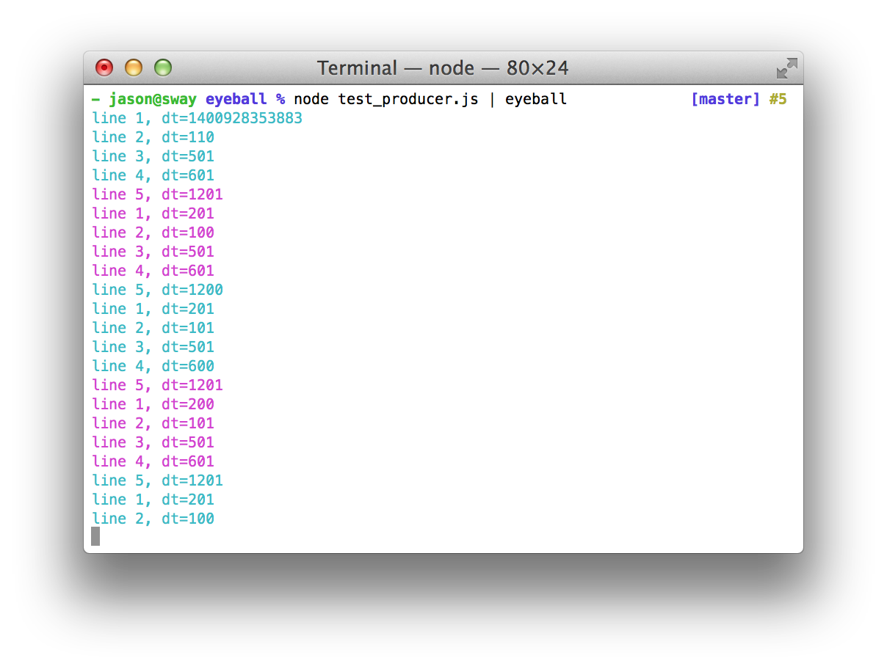

# eyeball

Here's some example output; note that the colour changes whenever `dt` &ge; 1000:



## Installation

	$ npm install -g eyeball

## Usage

```
Usage: eyeball [options]

Options:
  -c COLORS, --colors=COLORS  List of colors to cycle [default: cyan,magenta]
  -d DELAY, --delay=DELAY     Delay time, in seconds [default: 1]
  -n, --no-reset              Do no reset the timer after each line
  -v, --version               Display program version and quit
  -h, --help                  Display this message and quit
```

### Supported options

  * `-c COLORS, --colors=COLORS`: comma-separated list of colours through which to cycle. Supported values: `red`, `green`, `yellow`, `blue`, `magenta`, `cyan`, `reset`.
  * `-d DELAY, --delay=DELAY`: Delay time, specified in seconds.
  * `--no-reset`: Under normal conditions, `eyeball`'s point of reference for triggering a colour change is the time at which the previous line was written; that is, a colour change is triggered whenever the time difference between any two successive lines is &ge; DELAY. When `--no-reset` is specifed, this behaviour is adjusted such that colour change is instead triggered whenever the time since _the previous colour change_ is &ge; DELAY.
